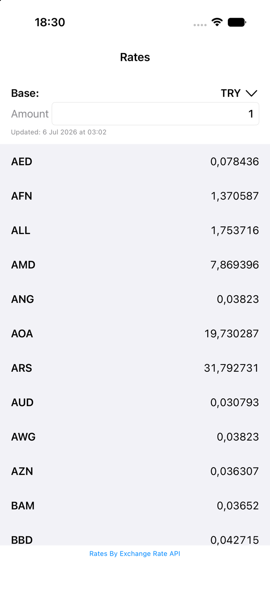
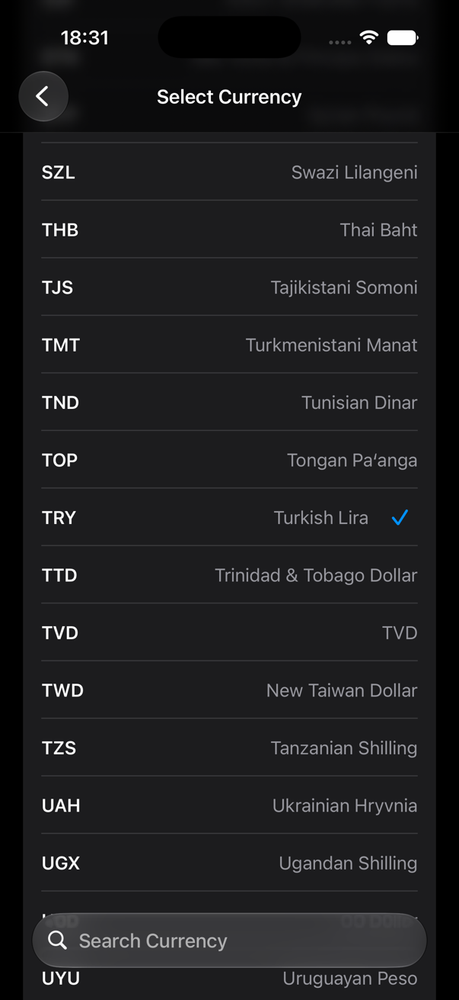
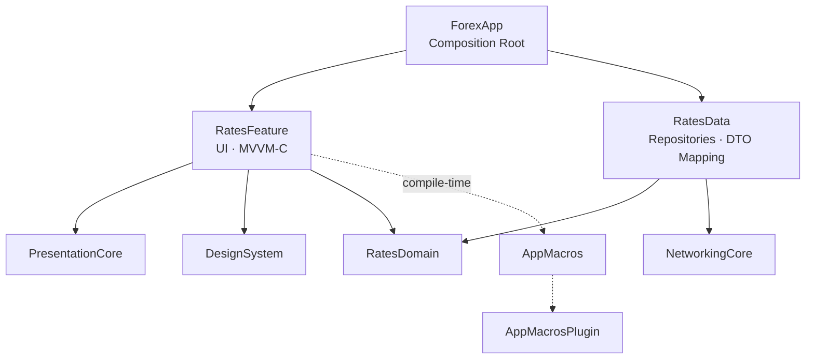

<div align="center">
  

  # ForexApp

  A modular, accessible currency rate application built with UIKit, Swift 6, and Tuist.

  [](https://github.com/Okariuss/ForexApp/actions/workflows/ci.yml)
</div>

## Overview

ForexApp displays current exchange rates for a selected base currency and recalculates them for locale-aware amount input.

The project focuses on modular architecture, strict concurrency, offline resilience, accessibility, localization, automated testing, and reproducible development tooling.

## Features

- Current exchange rates from ExchangeRate-API
- Configurable base currency
- Locale-aware amount parsing and formatting
- Searchable currency picker
- English and Turkish localization
- Offline cache with remote-failure fallback
- Pull-to-refresh without discarding existing content
- Light and Dark Modes
- Dynamic Type and accessibility text layouts
- VoiceOver metadata and semantic traits
- Reduce Motion support
- Custom shared-element currency transition
- Unit, accessibility, localization, coordinator, and snapshot tests
- GitHub Actions continuous integration

## Screenshots

<div align="center">
  
  
</div>

## Architecture

ForexApp uses a modular MVVM-C architecture with dependency injection.



`ForexApp` is the composition root. It constructs the concrete data layer and injects domain abstractions into feature modules. Dashed arrows represent compile-time tooling.

## Modules

| Module | Responsibility |
| --- | --- |
| `RatesDomain` | Currency models and repository contracts |
| `NetworkingCore` | Endpoints, HTTP loading, status validation, error mapping, and safe request logging |
| `RatesData` | ExchangeRate-API integration and versioned file cache |
| `RatesFeature` | Rate list and currency picker MVVM-C features |
| `PresentationCore` | Coordinator abstraction and reusable loadable state |
| `DesignSystem` | Spacing, typography, color, and animation tokens |
| `AppMacros` | Public compile-time macro declarations |
| `AppMacrosPlugin` | SwiftSyntax macro implementations |

## Data Flow

1. `RateListViewModel` requests rates through `RatesRepository`.
2. `CachedRatesRepository` attempts the remote request.
3. A successful response is returned and written to disk.
4. Cache write failures do not invalidate a successful remote response.
5. A remote failure falls back to the latest cache for the selected base currency.
6. Cancellation remains cancellation and never becomes a cache fallback.

The cache uses:

- A versioned JSON payload
- Separate files for each base currency
- Actor-serialized file access
- Atomic writes
- Data-layer persistence DTOs

## Technology

- Swift 6 language mode
- Swift 6.3.2 toolchain
- Strict concurrency
- UIKit with programmatic layout
- MVVM-C
- Tuist 4.118.1
- Swift Testing
- SnapshotTesting
- SwiftFormat
- SwiftLint
- GitHub Actions
- OSLog

## Requirements

- macOS with Xcode 26.5
- Homebrew
- iOS 26.0 or later

Tool versions are pinned in `.mise.toml`:

- Tuist 4.118.1
- SwiftFormat 0.61.1
- SwiftLint 0.65.0

## Setup

Clone the repository:

```sh
git clone https://github.com/Okariuss/ForexApp.git
cd ForexApp
```

Install the pinned tools and project dependencies:

```sh
make setup
```

Generate the workspace:

```sh
make generate
```

Open the generated workspace:

```sh
open ForexApp.xcworkspace
```

## Development Commands

| Command | Description |
| --- | --- |
| `make generate` | Generate the Xcode workspace |
| `make format` | Format Swift source files |
| `make format-check` | Verify formatting without modifying files |
| `make lint` | Run SwiftLint |
| `make build SCHEME=ForexApp` | Build the application |
| `make test SCHEME=RatesFeature` | Test a specific scheme |
| `make test-all` | Test all application and module schemes |
| `make check` | Run formatting, lint, and all tests |

Tests run with a deterministic English/US locale by default. Override it when needed:

```sh
make test SCHEME=RatesFeature TEST_LANGUAGE=tr TEST_REGION=TR
```

## Testing

The test suite covers:

- Domain validation
- Endpoint construction and networking behavior
- Transport, HTTP, decoding, and cancellation error mapping
- Remote/cache repository behavior
- Atomic file-cache persistence
- Rate-list loading, refresh, amount, and currency behavior
- Currency search and selection
- Coordinator routing and transition selection
- Localization key coverage and formatted strings
- VoiceOver labels, values, hints, and traits
- Component snapshots across appearance and content-size variants

GitHub Actions verifies every pull request and every push to `main` by running:

1. Pinned tool installation
2. Project dependency installation
3. SwiftFormat validation
4. SwiftLint
5. All test schemes
6. Application build

## Accessibility

ForexApp supports:

- Dynamic Type
- Accessibility text categories
- VoiceOver
- Reduce Motion
- Semantic accessibility labels and values
- Selected-state announcements
- Layout adaptation for large content sizes
- Minimum interactive hit areas

## Localization

The application currently supports:

- English
- Turkish

Localization resources are owned by `RatesFeature` and loaded from the framework bundle.

## API and Attribution

Rates are provided by [ExchangeRate-API](https://www.exchangerate-api.com).

The configured endpoint is:

```text
https://open.er-api.com/v6/latest/{baseCurrency}
```

The base URL and default currency are supplied through xcconfig-backed application configuration.

## Macro Troubleshooting

Xcode may occasionally report:

```text
AppMacrosPlugin produced malformed response
```

If this occurs after otherwise valid macro builds, clean the affected scheme:

```sh
xcodebuild \
  -workspace ForexApp.xcworkspace \
  -scheme RatesFeature \
  -configuration Debug \
  clean
```

This can be caused by stale DerivedData or plugin-process state. If cleaning the scheme does not resolve it, restart Xcode and rebuild the workspace.

## Acknowledgements

ForexApp is an independent portfolio project built by applying the architecture, testing, accessibility, and engineering practices I learned during the iCommunity Advanced iOS Bootcamp.

Special thanks to my instructor, [Seyfeddin Başsaraç](https://seyfedd.in), for his guidance throughout the program.
